# Hi, I'm Debasis Kumar Ghad​ai 👋

<picture>
  <source media="(prefers-color-scheme: dark)" srcset="./dark.svg">
  <source media="(prefers-color-scheme: light)" srcset="./light.svg">
  
</picture>

  <b>Junior Backend Developer · Python & Django · AI/ML · REST APIs</b>

  🐍 Python &nbsp;·&nbsp; ⚙️ Django / DRF &nbsp;·&nbsp; 🚀 FastAPI &nbsp;·&nbsp; 🗄️ PostgreSQL
  &nbsp;·&nbsp; ☁️ AWS &nbsp;·&nbsp; 🤖 AI/ML &nbsp;·&nbsp; 🐳 Docker

I build **backend systems, REST APIs, data-driven applications, and AI-powered products** using Python and modern backend technologies.

My engineering interests sit at the intersection of **backend development, AI/ML, API architecture, cloud infrastructure, and intelligent applications**.

---

## 🚀 What I Build

- 🐍 **Python backend systems** — Django, Django REST Framework and FastAPI
- 🔌 **REST APIs & integrations** — authentication, JWT, OAuth2 and API workflows
- 🤖 **AI / ML applications** — TensorFlow, Keras, XGBoost and LLM-oriented tooling
- 🗄️ **Data-driven systems** — PostgreSQL, MySQL, MongoDB and Redis
- ☁️ **Cloud & infrastructure** — AWS, Docker, Celery and Redis
- ⚛️ **Modern applications** — React, Vite and Tailwind CSS

---

## 💼 Experience

### Junior Backend Developer — FLASHO TECH PVT. LTD.
**Mar 2025 – Oct 2025 · Bhubaneswar**

Worked on backend development for the JSJ Card platform.

- Built REST APIs using **Python, Django and Django REST Framework**
- Worked with **PostgreSQL** for application data
- Implemented authentication using **JWT / SimpleJWT and OAuth2**
- Used **Celery and Redis** for background processing
- Worked with **AWS EC2 and AWS S3**
- Tested and documented APIs using **Postman and Swagger**

---

## 🧩 Featured Projects

### 📈 AI-Powered Indian Equity Research & Risk Intelligence Platform

**Python · FastAPI · LangGraph · LangChain · RAG · LLM · XGBoost · PostgreSQL · React · AWS**

AI-powered platform for Indian equity research, market intelligence, technical analysis, news sentiment and portfolio risk analytics.

- Multi-agent workflow using LangGraph
- RAG pipeline over filings
- Technical indicators and fundamental analysis
- News sentiment and portfolio risk analytics
- XGBoost market-signal modelling
- Time-aware validation and backtesting

---

### 🤖 AgentVerse

**React · Vite · Tailwind CSS · Python · FastAPI · PostgreSQL**

A platform concept for discovering and interacting with specialized AI agents.

- Agent discovery
- Authentication
- Agent profiles
- Chat / interaction workflows
- Service-oriented backend architecture

---

### 🧠 Real-Time Emotion Detection

**Python · TensorFlow · Keras · CNN**

Real-time emotion detection using a CNN-based deep-learning pipeline.

---

### 🧬 MRI Brain Tumor Detection

**Python · TensorFlow · Keras · Xception · InceptionV3**

MRI brain-tumor classification using transfer learning.

**Project result supplied:** 7000+ MRI scans and 99% accuracy.

---

### 💳 Credit Risk Prediction System

**Python · Scikit-learn · XGBoost · Streamlit**

Machine-learning system for credit-risk prediction using Logistic Regression, Random Forest and XGBoost.

**Project result supplied:** 92% accuracy.

---

## 🛠️ Engineering Stack

### 🐍 Languages
`Python` `JavaScript`

### ⚙️ Backend
`Django` `Django REST Framework` `FastAPI` `REST APIs`

### 🤖 AI / ML
`TensorFlow` `Keras` `CNN` `XGBoost` `LangChain` `LangGraph` `RAG` `LLM`

### 🗄️ Databases
`PostgreSQL` `MySQL` `MongoDB` `SQLite` `Redis`

### ☁️ Cloud / DevOps
`AWS EC2` `AWS S3` `Docker` `Celery`

### ⚛️ Frontend
`React` `Vite` `Tailwind CSS`

### 🔧 Tools
`Git` `GitHub` `Postman` `Swagger` `VS Code`

---

## 📊 GitHub

I use GitHub to build, experiment, learn, and document software projects across backend engineering, AI/ML and modern application development.

  

---

## 📫 Connect With Me

  💻 <a href="https://github.com/kumardebasis2003">GitHub</a> 
  💼 <a href="https://www.linkedin.com/in/debasis-kumar-ghadai-8397a9238/">LinkedIn</a>

---

> **Build APIs. Ship systems. Explore AI.**

  Designed as a terminal-inspired engineering profile.

